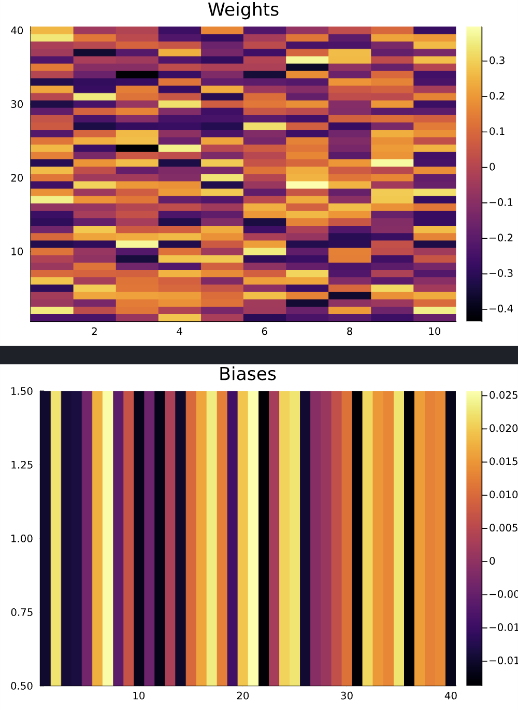
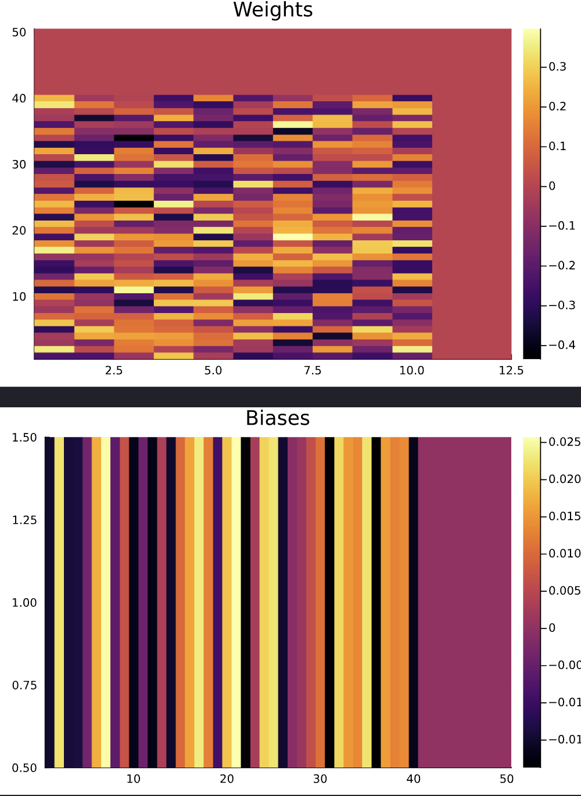

# Extender

Extender is a specialized tool designed to augment neural network models by adding additional neurons without altering the network's output. By appending zeros as weights and biases for new neurons, NN_Extender ensures seamless scalability of neural network models.

<div style="display: flex;">
    <div style="text-align: center;">
        <p>BEFORE</p>
        
    </div>
    <div style="text-align: center;">
        <p>AFTER</p>
        
    </div>
</div>

## Installation

Firstly, you need to install all dependencies required for this project. You can do it easily just run:

```bash
make install
```

This command creates file `Manifest.toml`. It means that you are ready to run this code.

## Usage

There are two ways to run this code:

1. From `Jupyter Notebook` (recommended). For this, you need to run all cells from `run_me.ipynb` file. It will do everything for `example-methanol-model.bson` file automatically.
2. From the terminal. If you want to run this program as a command-line application:
   - `julia --project=. main.jl`
   - or `make run` to run the example

## Authors and License

- Maksim Posysoev (<maxim.posysoev@gmail.com>)
- Prof. Alexander Lyubartsev (<alexander.lyubartsev@mmk.su.se>)

*GNU GPL-3.0 license*
